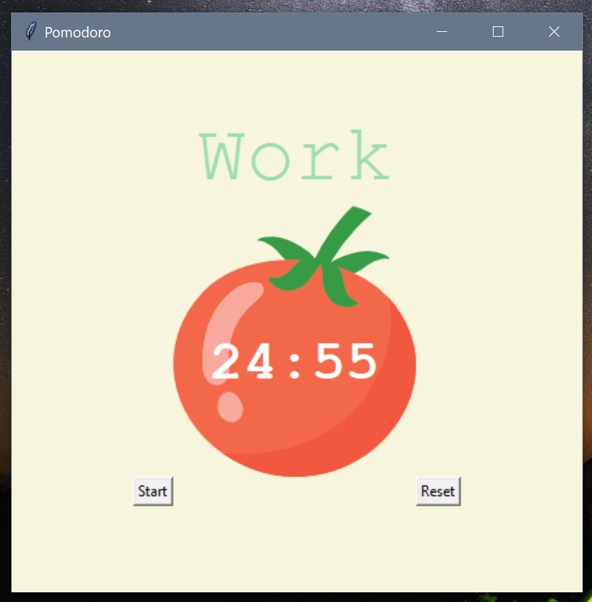

# Pomodoro Timer

A GUI timer built with Tkinter module.



## How to use

First clone the repository and install the Tkinter module. Then run the following command:

```
python main.py
```

## Show your support

Give a ⭐️ if you like this project!

## License

[MIT](LICENSE)